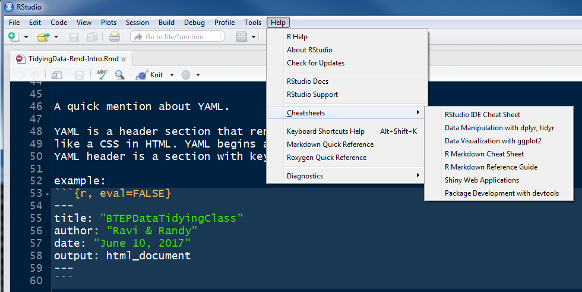
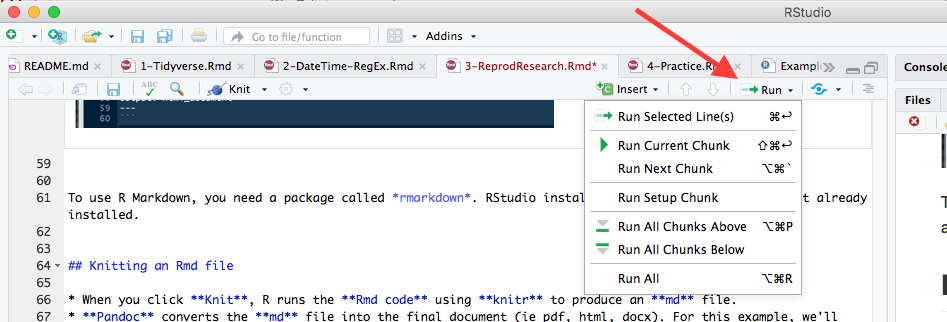

Data Tidying: Rmd Intro
================
Drs.S. Ravichandran and Randall Johnson

Table of Contents
=================

1.  [R Markdown and Reproducible Research](#Rmarkdown)

    1.1 [R Markdown basics](#basics)

    1.2 [R Markdown creation](#creation)

    1.3 [Code chunks](#code)

    1.4 [Tables](#tables)

    1.5 [Knitting an Rmd file](#knitr)

<a name="Rmarkdown"></a>R Markdown and Reproducible Research
============================================================

R Markdown is a nice way to organize thoughts and R code output in a report. When you knit your Rmd file, it will run your code and put the output into a formatted document complete with figures and tables (i.e. not plain text).

<a name="basics"></a>R Markdown basics
--------------------------------------

-   R Markdown, often abbreviated as Rmd
-   Like HTML, it is a set of rules for formatting plain text,
-   You can use Rmd file to create texts with formatting, plots, hyperlinks etc.

<a name="creation"></a>R Markdown creation
------------------------------------------

This section will be based on RStudio. But, one can create Rmd file manually. To create an Rmd file using RStudio's template use the menu option: File -&gt; New File -&gt; R Markdown


A window will pop-up asking you to choose the Title and Author and other information (see below)


### YAML

A quick mention about Yet Another Markup Language (YAML)

YAML is a header section that renders your .Rmd file. It is almost like a CSS in HTML. YAML begins and ends with --- tags. YAML header is a section with key:Value pairs

example:

    ---
    title: "Data Tidying Seminar"
    author: "Ravi & Randy"
    output: word_document
    ---

### Cheat Sheets

Rmd format help is available within RStudio. You can find the Cheatsheets under Help -&gt; Cheatsheets:



To use R Markdown, you need a package called *rmarkdown*. RStudio installs it automatically if it isn't already installed.

<a name="code"></a>Code chunks
------------------------------

To effectively use Rmd file, you need to insert what is called *chunk* (use Cmd (Mac)/Ctrl-Alt-I (Windows) to create a chunk). Here is an example of a code chunk:

    ```{r Chunk name}
    # Hello World!
    x <- 1:10
    ```

To run a Chunk interactively (i.e. while you are actively writing the document, not when trying knit), you can use the Run button. This will allow you to run a single line of code or an entire chunk of code.



### Code chunk options

There are several Chunk options can modify the execution of the R code present in the chunk. We list a few here. Please refer to the [RMarkdown manual](https://www.rstudio.com/wp-content/uploads/2015/03/rmarkdown-reference.pdf) for details. Some examples include:

-   `echo=FALSE` tells knitr not display the the source code. Only the output will be shown.
-   `include=FALSE` tells knitr to execute the code chunk, but no output will be shown in the document. Any packages loaded or variables created will be available in other code chunks, though.
-   `error=TRUE` tells knitr to display error messages and continue executing. Normally the knitr process will fail if there are errors in your code. You only want to use this if you are purposely trying to demonstrate an error.

You can set global options for knitr at the top of the Rmd document. This will change the default for all code chunks following the command. For example, if you wanted to tell knitr not to echo code (i.e. just show the output), you could include the following in the *setup* chunk:

      knitr::opts_chunk$set(echo = FALSE)

### Inline code

You can also include code inside of your text.

To quote code:

    Here is how you take the mean of a variable, _x_: `mean(x)`.

This displays as:

Here is how you take the mean of a variable, *x*: `mean(x)`.

To execute code inline:

    Diamonds package in ggplot2 contains the prices of 60K round cut diamonds.
    This data set contains information for `r nrow(diamonds)` diamonds.

This displays as:

Diamonds package in ggplot2 contains the prices of 60K round cut diamonds. The data set contains information for 53940 diamonds.

<a name="tables"></a>Tables
---------------------------

Rmd files can provide a nice Table layout.

``` r
knitr::kable(
  diamonds[1:4, ], 
  caption = "Example of knitr kable"
)
```

|  carat| cut     | color | clarity |  depth|  table|  price|     x|     y|     z|
|------:|:--------|:------|:--------|------:|------:|------:|-----:|-----:|-----:|
|   0.23| Ideal   | E     | SI2     |   61.5|     55|    326|  3.95|  3.98|  2.43|
|   0.21| Premium | E     | SI1     |   59.8|     61|    326|  3.89|  3.84|  2.31|
|   0.23| Good    | E     | VS1     |   56.9|     65|    327|  4.05|  4.07|  2.31|
|   0.29| Premium | I     | VS2     |   62.4|     58|    334|  4.20|  4.23|  2.63|

Compare this to the traditional table

``` r
diamonds[1:5,]
```

    ## # A tibble: 5 x 10
    ##   carat cut     color clarity depth table price     x     y     z
    ##   <dbl> <ord>   <ord> <ord>   <dbl> <dbl> <int> <dbl> <dbl> <dbl>
    ## 1 0.230 Ideal   E     SI2      61.5   55.   326  3.95  3.98  2.43
    ## 2 0.210 Premium E     SI1      59.8   61.   326  3.89  3.84  2.31
    ## 3 0.230 Good    E     VS1      56.9   65.   327  4.05  4.07  2.31
    ## 4 0.290 Premium I     VS2      62.4   58.   334  4.20  4.23  2.63
    ## 5 0.310 Good    J     SI2      63.3   58.   335  4.34  4.35  2.75

<a name="knitr"></a>Knitting an Rmd file
----------------------------------------

-   When you click **Knit**, R runs the **Rmd code** using **knitr** to produce an **md** file.
-   **Pandoc** converts the **md** file into the final document (i.e. pdf, html, docx). For this example, we'll choose a Word document.
-   Note that the output PDF requires you to install LaTeX
    -   For Windows OS, [MiKTeX](https://miktex.org) provides an up-to-date implementation of TeX/LaTeX
