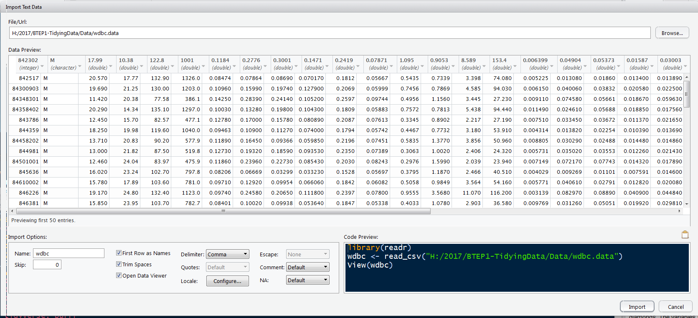

Data Tidying: Practice
================

### Cleaning up

For the remainder of our time, you may continue to work on this example data set or begin working with your own data. If you would like to continue with this example, open the a copy of this Rmd file and edit it. Include all of your answers in the Rmd file, as well as any other code and relevant discussion. We will stick around for awhile to answer any questions you might have.

Hands-on exercise using Wisconsin Breast Cancer dataset
=======================================================

Now, we will read a slightly complicated Breast Cancer dataset. You may use the import data set drop-down option to read the data in, but be sure to save the code generated by the dialog and record it in the code chunk below.

 

``` r
# Modify the chunk statement such that no output is shown for this chunk

# import the data set here
...

# Add column names:
cnames <- c("ID", "Diagnosis", 
            "radius", "Texture", "Perimeter", "area",
            "smoothness", "compactness", "concavity", "concave_points",
            "symmetry","fractaldim",
            "radiusSE", "TextureSE", "PerimeterSE", "areaSE",
            "smoothnessSE", "compactnessSE", "concavitySE", "concave_pointsSE",
            "symmetrySE","fractaldimSE",
            "radiusW", "TextureW", "PerimeterW", "areaW",
            "smoothnessW", "compactnessW", "concavityW", "concave_pointsW",
            "symmetryW","fractaldimW")

# add column names here
...
```

The `wdbc` data set has samples and covariates. There are mean, standard error and worst observations for the following measures (see the [wdbc.names](https://github.com/ravichas/TidyingData/blob/master/Data/wdbc.names) file for more details):

-   Texture
-   Perimeter
-   area
-   smoothness
-   compactness
-   concavity
-   concave\_points
-   symmetry
-   fractaldim

Figures showing the raw relationship between diagnosis (benign or metastatic) tumors and some of these measures follows:

``` r
# do not echo the code from this chunk, but do show the figures

# Diagnosis by radius
ggplot(wdbc, aes(Diagnosis, radius)) + 
    geom_jitter()

# Diagnosis by Texture
ggplot(wdbc, aes(Diagnosis, Texture, color = TextureSE)) + 
    geom_jitter()

# Diagnosis by Perimiter
ggplot(wdbc, aes(Diagnosis, Perimeter, color = PerimeterSE)) + 
    geom_jitter()

# Diagnosis by smoothness
ggplot(wdbc, aes(Diagnosis, smoothness, color = smoothnessSE)) + 
    geom_jitter()

# we didn't cover plotting with ggplot(), but feel free to add more figures if you would like
```

``` r
# run this chunk, but do not print any of it's output to the document

# number of individuals with benign tumors
nBenign <- ...

# number of individuals with metastatic tumors
nMetastatic <- ...

# individuals with PerimeterSE > 5
nPerimeterSE_gt5 <- ... # number of indiviuals with PerimeterSE > 5
pctPerimeterSE_gt5 <- ... # % of indiviuals with PerimeterSE > 5 (wrt entire data set)
pctPerimeterSE_gt5_M <- ... # % of indiviuals diagnosed as 'M' (wrt individuals where PerimeterSE > 5)

##### creation of summaryTable #####

# Create a subset of wdbc containing only individuals with Diagnosis == 'B'
# and keep only Texture, Perimeter, area, smoothness, compactness, concavity, 
#               concave_points, symmetry, and fractaldim
meanBenign <- ...
    
# Create a subset of wdbc containing only individuals with Diagnosis == 'B'
# and keep only Texture, Perimeter, area, smoothness, compactness, concavity, 
#               concave_points, symmetry, and fractaldim
meanMetast <- ...

# fill table in with mean values among individuals with benign/metastatic diagnosis
summaryTable <- tibble(measure = c('Texture', 'Perimeter', 'area', 'smoothness',
                                   'compactness', 'concavity', 'concave_points', 
                                   'symmetry', 'fractaldim'),
                       meanB = apply(meanBenign, 2, mean),
                       meanM = apply(meanMetast, 2, mean))
```

The perimter of the cells appears to be fairly consistent within most samples, but % of the samples had a standard error over 5. Of these, % were diagnosed as metastatic.

| measure         | meanB      | meanM      |
|:----------------|:-----------|:-----------|
| Texture         | incomplete | incomplete |
| Perimeter       | incomplete | incomplete |
| area            | incomplete | incomplete |
| smoothness      | incomplete | incomplete |
| compactness     | incomplete | incomplete |
| concavity       | incomplete | incomplete |
| concave\_points | incomplete | incomplete |
| symmetry        | incomplete | incomplete |
| fractaldim      | incomplete | incomplete |
