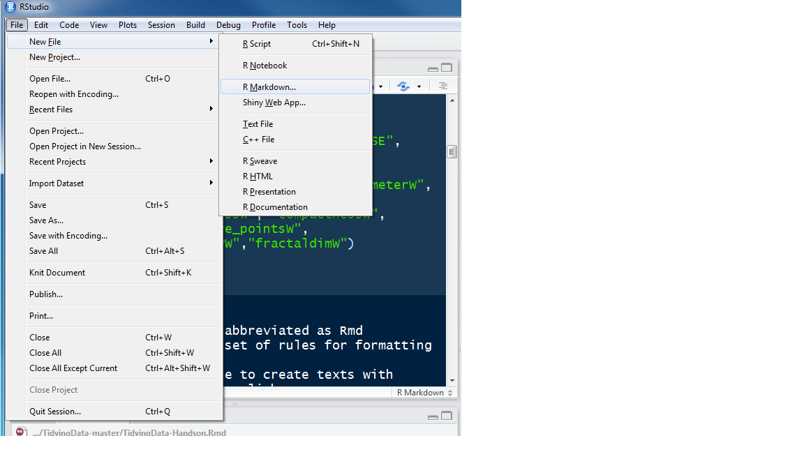
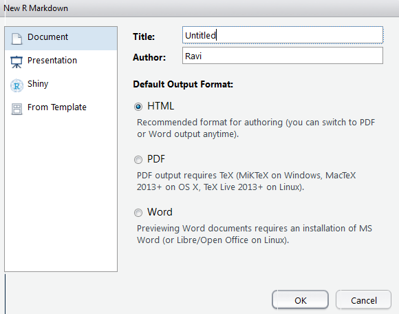
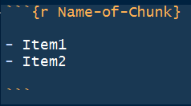
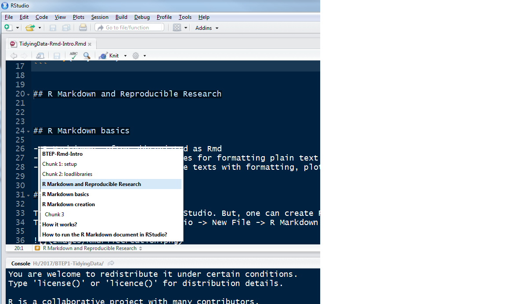

BTEP Rmd Intro
================
Drs.S. Ravichandran and Randall Johnson
February 26, 2017

Let us load the libraries and do some cleanup

``` r
# will clean up the history
rm(list=ls(all=TRUE))
#install.packages("tidyverse")
library(tidyverse) 
```

    ## Loading tidyverse: ggplot2
    ## Loading tidyverse: tibble
    ## Loading tidyverse: tidyr
    ## Loading tidyverse: readr
    ## Loading tidyverse: purrr
    ## Loading tidyverse: dplyr

    ## Conflicts with tidy packages ----------------------------------------------

    ## filter(): dplyr, stats
    ## lag():    dplyr, stats

R Markdown and Reproducible Research
------------------------------------

R Markdown basics
-----------------

-   R Markdowwn, often abbreviated as Rmd
-   Like HTML, it is a set of rules for formatting plain text,
-   You can use Rmd file to create texts with formatting, plots, hypoelinks etc.

R Markdown creation
-------------------

This section will be based on RStudio. But, one can create Rmd file manually. To create a template use, RStudio -&gt; New File -&gt; R Markdown



A window will pop-up asking you to choose the Title and Author and other information (see below)



You can also read in your previously created Rmd file.

A quick mention about Yet Another Markup Language (YAML)

YAML is a header section that renders your .Rmd file. It is almost like a CSS in HTML. YAML begins and ends with --- tags. YAML header is a section with key:Value pairs

example:

``` r
---
title: "BTEPDataTidyingClass"
author: "Ravi & Randy"
date: "June 10, 2017"
output: html_document
---
```

Rmd format help is available within RStudio. You can find the CheatSheets here,


To use R Markdown, you need a package called rmardown. RStudio installs it automatically when you need them.

How it works?
-------------

-   When you click **Knit**, R runs the **Rmd code** using **knitr** to produces an **md** file
-   **Pandoc** converts the **md** file into the final document (ie pdf, html)
-   Note that the output PDF requires you to install LaTeX
    -   For Windows OS, MiKTeX ( <https://miktex.org> ) provides an up-to-date implementation of TeX/LaTeX

How to run the R Markdown document in RStudio?
----------------------------------------------

-   To effectively use Rmd file, you need to insert what is called *chunk*
    -   use Cmd (Mac)/Ctrl-Alt-I (Windows) to create a chunk
-   Here is an example



-   To run a Chunk (the code associated with the chunk), look at the drop-down from the bottom-left, **RMarkdown and Reproducible Resarch** dropdown (see the image below)



-   There are several Chunk options (ex. eval = FALSE ) can modify the execution of the R code present in the chunk. Please refer to the RMarkdown manual for details.

Table
-----

-   Rmd files can provide a nice Table layout.

``` r
knitr::kable(
  diamonds[1:4, ], 
  caption = "Example of knitr kable"
)
```

|  carat| cut     | color | clarity |  depth|  table|  price|     x|     y|     z|
|------:|:--------|:------|:--------|------:|------:|------:|-----:|-----:|-----:|
|   0.23| Ideal   | E     | SI2     |   61.5|     55|    326|  3.95|  3.98|  2.43|
|   0.21| Premium | E     | SI1     |   59.8|     61|    326|  3.89|  3.84|  2.31|
|   0.23| Good    | E     | VS1     |   56.9|     65|    327|  4.05|  4.07|  2.31|
|   0.29| Premium | I     | VS2     |   62.4|     58|    334|  4.20|  4.23|  2.63|

Compare this to the traditional table

``` r
diamonds[1:5,]
```

    ## # A tibble: 5 × 10
    ##   carat     cut color clarity depth table price     x     y     z
    ##   <dbl>   <ord> <ord>   <ord> <dbl> <dbl> <int> <dbl> <dbl> <dbl>
    ## 1  0.23   Ideal     E     SI2  61.5    55   326  3.95  3.98  2.43
    ## 2  0.21 Premium     E     SI1  59.8    61   326  3.89  3.84  2.31
    ## 3  0.23    Good     E     VS1  56.9    65   327  4.05  4.07  2.31
    ## 4  0.29 Premium     I     VS2  62.4    58   334  4.20  4.23  2.63
    ## 5  0.31    Good     J     SI2  63.3    58   335  4.34  4.35  2.75

Global Options
==============

You can set global optons for knitr at the top of the Rmd document.

<pre> <code>
  knitr::opts_chunk$set( 
    echo = FALSE 
  ) 
</code></pre>
Finally, a brief mention about inline codes.

Explore the following code with inline R option that produces the following output:

<pre> <code>
Diamonds package in ggplot2 contains the prices of 60K round cut diamonds. 
Dataset contains information about 53940 diamonds.  
</code></pre>
Diamonds package in ggplot2 contains the prices of 60K round cut diamonds. Dataset contains information about 53940 diamonds.
