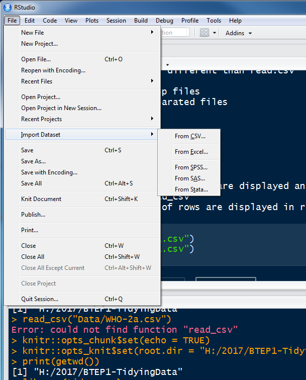

BTEP-FinalExercise
================
Drs. Sarangan Ravichandran and Randall Johnson
February 26, 2017

### Cleaning up

Before we begin, let us clean up the environment and set a working directory. This will clear all the variables and start fresh. If you want to follow on, then we suggest you to run the following lines.

``` r
setwd("H:/2017/BTEP1-TidyingData")
rm(list = ls())
```

### Loading the libraries

Let us first load the libraries needed for the workshop

``` r
# if you dont have tidyverse then run the following line once 
# install.packages(c("tidyverse", "knitr"))
library(tidyverse)
```

    ## Loading tidyverse: ggplot2
    ## Loading tidyverse: tibble
    ## Loading tidyverse: tidyr
    ## Loading tidyverse: readr
    ## Loading tidyverse: purrr
    ## Loading tidyverse: dplyr

    ## Conflicts with tidy packages ----------------------------------------------

    ## filter(): dplyr, stats
    ## lag():    dplyr, stats

``` r
library(knitr)
library(lubridate)
```

    ## 
    ## Attaching package: 'lubridate'

    ## The following object is masked from 'package:base':
    ## 
    ##     date

Hands-on exercise using Wisconsin Breast Cancer dataset
-------------------------------------------------------

Now, let us read a slightly complicated Breast Cancer dataset. First let us use the import data set drop-down option

 

``` r
wdbc <- read_csv("Data/wdbc.data", col_names = FALSE)
```

    ## Parsed with column specification:
    ## cols(
    ##   .default = col_double(),
    ##   X1 = col_integer(),
    ##   X2 = col_character()
    ## )

    ## See spec(...) for full column specifications.

``` r
#wdbctry2 <- read_csv("C:/Users/Ravi/Desktop/BTEP/Data/wdbc.data", header = FALSE)
names(wdbc)
```

    ##  [1] "X1"  "X2"  "X3"  "X4"  "X5"  "X6"  "X7"  "X8"  "X9"  "X10" "X11"
    ## [12] "X12" "X13" "X14" "X15" "X16" "X17" "X18" "X19" "X20" "X21" "X22"
    ## [23] "X23" "X24" "X25" "X26" "X27" "X28" "X29" "X30" "X31" "X32"

Let us add column names

``` r
cnames <- c("ID", "Diagnosis", 
            "radius", "Texture", "Perimeter", "area",
            "smoothness", "compactness", "concavity", "concave_points",
            "symmetry","fractaldim",
            "radiusSE", "TextureSE", "PerimeterSE", "areaSE",
            "smoothnessSE", "compactnessSE", "concavitySE", "concave_pointsSE",
            "symmetrySE","fractaldimSE",
            "radiusW", "TextureW", "PerimeterW", "areaW",
            "smoothnessW", "compactnessW", "concavityW", "concave_pointsW",
            "symmetryW","fractaldimW")

names(wdbc) <- cnames
```

Let us find out how many samples we have in the dataset?

``` r
nrow(wdbc)
```

    ## [1] 569

How many covariates are in the dataset? We can look at the Global environment (top right) window to get the information We can also find that out by typing the following command:

``` r
ncol(wdbc)
```

    ## [1] 32
